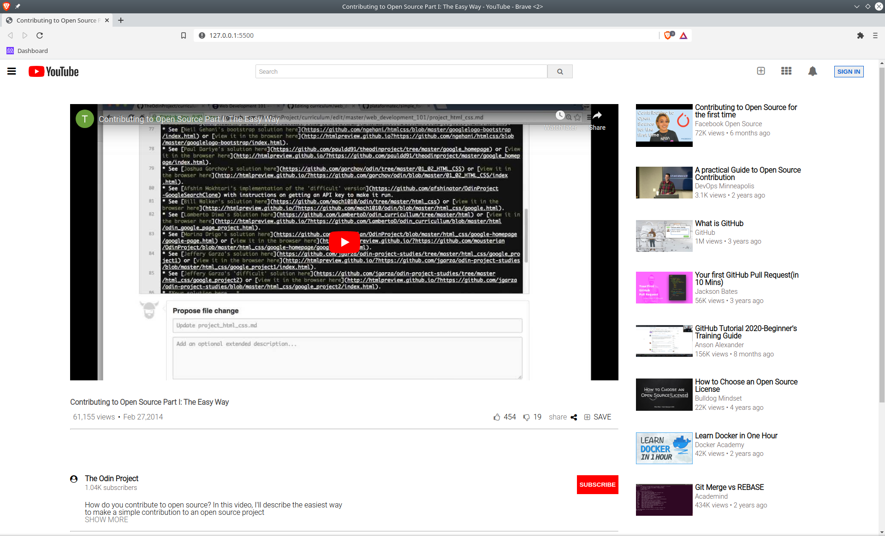

# YouTube Video Page Clone
This is the first project of the MIcroverse HTML/CSS Course.
The requirement is to create a webpage that looks like the YouTube video player

# Built With
- HTML
- CSS
- Flexbox and Grid

# Live Demo
https://kimothokamau.github.io/youtubeclone_mv1/

## Getting Started

To get a local copy up and running follow these steps:

### Prerequisites

Git installed in your PC

### Setup

Navigate to the desired directory in your PC and run:

<pre><code> git clone [the url of this repo] </code></pre>

### Usage

Navigate to the local repo that you have cloned in the above step and open the index.html file
The webpage will open in your browser

## Authors

👤 **Author1**

- GitHub: [@githubhandle](https://github.com/rebeccayilma)

👤 **Author2**

- GitHub: [@githubhandle](https://github.com/kimothokamau)

## 🤝 Contributing

Contributions, issues, and feature requests are welcome!

Feel free to check the [issues page](issues/).

## Show your support

Give a ⭐️ if you like this project!

